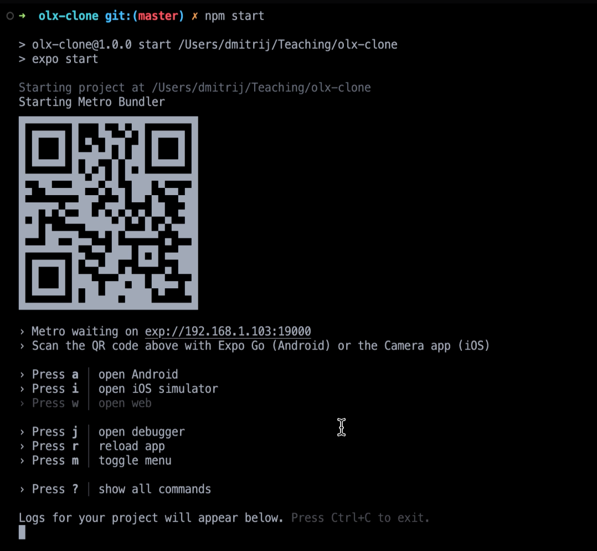

# goit-ReactNative-hw

<h1>Home Work 1</h1>

$ npx create-expo-app AwesomeProject

потім перейти у папку проекту і Ви вже можете його запустити за допомогою команди

$ cd AwesomeProject

$ npx expo install expo-font 

$ npx expo start

Для того, щоб відкрити свій додаток на тестовому девайсі Вам достатньо:

завантажити з магазину (App Store або Play Market) додаток Expo Go

відсканувати QR код, який у Вас з’явиться в терміналі

<h1>Home Work 4</h1>

<h3>Підключення навігації до проекту</h3>

$ npm install @react-navigation/native 

$ npx expo install react-native-screens react-native-safe-area-context 

Після встановлення всіх залежностей потрібно додати навігацію. Для цього в App додаємо обгортку NavigationContainer

Аналогом NavigationContainer у web слугує BrowserRouter

Для більшої гнучкості розробники React Navigation розбили свою бібліотеку на умовно незалежні частини. Завдяки цьому Ви можете встановлювати тільки ті компоненти, які Вам необхідні для вирішення певних задач. Наприклад, для роботи із звичайною навігацією є бібліотеки @react-navigation/native-stack , @react-navigation/stack , якщо Ви хочете зробити навігацію із кнопками знизу - є @react-navigation/bottom-tabs та інше. В офіціальній документації наводиться приклад роботи із native-stack. Його переваги у тому, що він працює більш швидко, бо написаний із використанням нативних компонентів(на відміну від @reac-navigation/stack). Але він дуже погано кастомізується і з дуже великою вірогідністю панель навігації буде по-різному виглядати на різних платформах(це не є погано, але інколи треба зробити так, як в дизайні, а нативні рішення не зовсім зручні в такому випадку). Тому ми будемо використовувати @react-navigation/stack.

$ npm install @react-navigation/stack

$ npx expo install react-native-gesture-handler

А також додати імпорт цієї бібліотеки у найвищий файл в ієрархії проекту - App.js.

Для групування екранів та рендеру окремого екрану використовують результат роботи функції createStackNavigator.

createStackNavigator - повертає об'єкт, що містить 2 властивості: Screen та Navigator. Вони є компонентами React, які використовуються для налаштування навігатора. Navigator повинен містити елементи Screen як дочірні елементи для визначення конфігурації маршрутів.

<h3>Нижня навігація</h3>

$ npm install @react-navigation/bottom-tabs

$ npm install @expo/vector-icons

